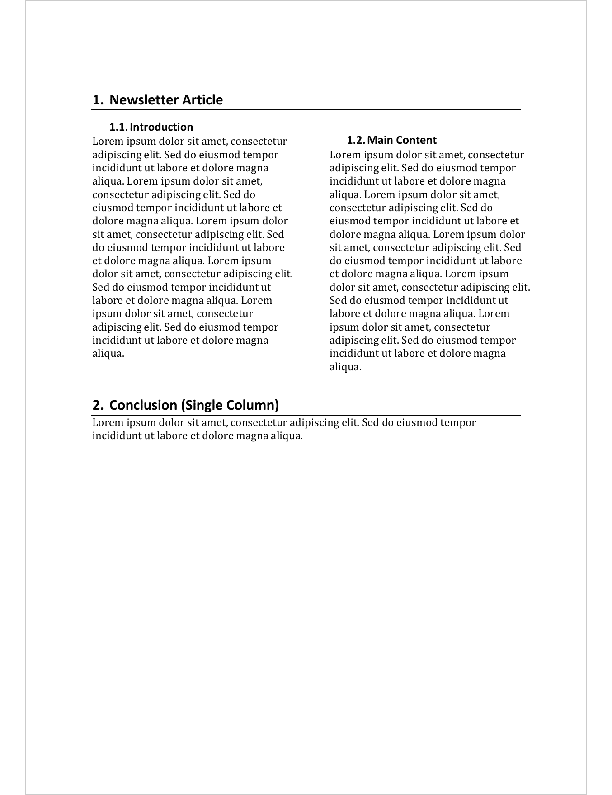

# Add any section

Add a section to the document. You can define any section with a
[block_section](https://davidgohel.github.io/officer/reference/block_section.md)
object. All other `body_end_section_*` are specialized, this one is
highly flexible but it's up to the user to define the section
properties.

## Usage

``` r
body_end_block_section(x, value)
```

## Arguments

- x:

  an rdocx object

- value:

  a
  [block_section](https://davidgohel.github.io/officer/reference/block_section.md)
  object

## Section model in Word

A `block_section` added with `body_end_block_section()` applies to the
content that **precedes** the call: it closes the section that holds the
previous paragraphs / tables and inherits any layout (orientation,
columns, margins, headers / footers) defined by the `block_section`. The
function name reflects this: it marks the *end* of a section.

Typical pattern: add the content, then close it with the section that
should layout it.

    doc <- read_docx() |>
      body_add_par("This paragraph is in landscape orientation.") |>
      body_end_block_section(block_section(prop_section(
        page_size = page_size(orient = "landscape")
      )))

The default section of the document (defined by the template or by
[`body_set_default_section()`](https://davidgohel.github.io/officer/reference/body_set_default_section.md))
closes any content added after the last `body_end_block_section()` call.

The RTF output uses the opposite model: `rtf_add(block_section(...))`
applies to the content that *follows* the call. See
[`rtf_add()`](https://davidgohel.github.io/officer/reference/rtf_add.md).

## Illustrations



## See also

Other functions for Word sections:
[`body_end_section_columns()`](https://davidgohel.github.io/officer/reference/body_end_section_columns.md),
[`body_end_section_columns_landscape()`](https://davidgohel.github.io/officer/reference/body_end_section_columns_landscape.md),
[`body_end_section_continuous()`](https://davidgohel.github.io/officer/reference/body_end_section_continuous.md),
[`body_end_section_landscape()`](https://davidgohel.github.io/officer/reference/body_end_section_landscape.md),
[`body_end_section_portrait()`](https://davidgohel.github.io/officer/reference/body_end_section_portrait.md),
[`body_set_default_section()`](https://davidgohel.github.io/officer/reference/body_set_default_section.md)

## Examples

``` r
library(officer)
str1 <- "Lorem ipsum dolor sit amet, consectetur adipiscing elit."
str1 <- rep(str1, 20)
str1 <- paste(str1, collapse = " ")

ps <- prop_section(
  page_size = page_size(orient = "landscape"),
  page_margins = page_mar(top = 2),
  type = "continuous"
)

doc_1 <- read_docx()
doc_1 <- body_add_par(doc_1, value = str1, style = "Normal")
doc_1 <- body_add_par(doc_1, value = str1, style = "Normal")

doc_1 <- body_end_block_section(doc_1, block_section(ps))

doc_1 <- body_add_par(doc_1, value = str1, style = "centered")

print(doc_1, target = tempfile(fileext = ".docx"))
```
